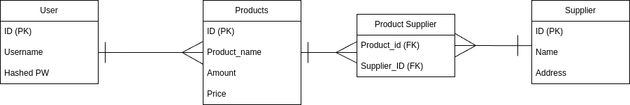

# CLI INVENTORY MANAGEMENT
#### Video Demo: <URL HERE>
#### Description: 
Final Project CS50x ~ Shvan Jaro
Hi this is my final project for CS50x: Introduction to Computer Science.
My final project is an cli program, that entails an inventory management system to easily track the inventory of businesses. 
The cli program allows the user to add/remove/modify and track the inventory of their business.

TODO:
✅ 1. Make the display for the starting page of the CLI program 

✅ 2. Complete get user input number
- Don't use cs50.h
- Create get input yourself 

3. Create DB
- Create DB with sqlite3
- Link db into C program
- READ SQLite C api docs

DB GRAPH: 

4. Redirect user to pages
- Redirect user to register page (If user types 1 display the following things):
    - First clear terminal screen
    - Username (Must be unique, so check DB):
    - Password (Save hashed version in DB): ****
    - Password (Repeat): 

- Redirect user to login page (If user types 2 display the following things):
    - First clear terminal screen
    - Username:
    - Password (*)

✅ - Show the user the description (If user types 3 display the following things):
    - display_description
    - display menu
    - ONly add the description at the top of the menu, and refresh the page. 

5. Complete register -> SQlite API for C
- When an user registers, it should be put in an sqlite database
- Registering with an existing username should show an error
- Store HASHED password in database

6. Complete Login 
- When an user logs in check username if in db
- When user logs in check password in db
- If one of the two fails display error

7. Complete inventory UI
- User has the option to add inventory
- Put this item in DB
- Show DB items in home 
- Remove Inventory
- Remove from DB
- Remove from UI

