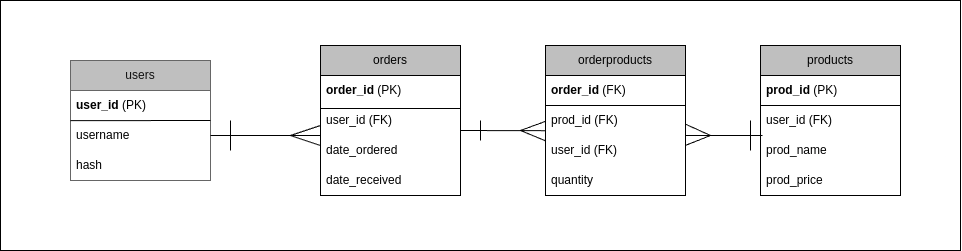

# Inventory Management

## CS50x Final Project by Shvan Jaro

Welcome to my final project for CS50x: Introduction to Computer Science. This command-line interface (CLI) application functions as an inventory management system, written in C. It enables you to add, remove, and modify items, ensuring you can easily maintain and track stock levels.

All application data is stored in inventory.db, an SQLite database that includes the following tables:

By using this CLI tool, you can efficiently manage your inventory without dealing with complicated graphical interfaces. The underlying database structure ensures that your data remains organized, consistent, and easily accessible.

## Dependencies
To build and run this application, ensure that the following dependencies are installed:
    • SQLite3: Required for local database operations.
    • Libsodium: Provides Argon2 password hashing functionality.
    • unistd.h: A standard POSIX header (available on Unix-like systems) for various system calls and functions.
    • Make: Used to compile the program using the provided Makefile.

## Features
    • Secure Account Management:
        ◦ Users can register for accounts.
        ◦ Passwords are hashed using the Argon2 algorithm via the libsodium API, ensuring secure password storage.

    • Comprehensive Inventory Operations:
        ◦ Perform basic CRUD (Create, Read, Update, Delete) operations on a local database (using `sqlite3`).
        ◦ View inventory details, including product ID, name, price, quantity, and total value.

    • User-Friendly Interaction:
        ◦ Upon login, the user's entire inventory is displayed.
        ◦ Clear menu options guide the user:
            ▪ 0: Exit the application
            ▪ 1: Register a new account
            ▪ 2: Log in to an existing account
            ▪ 3: View application description.

>[!NOTE] 
> Invalid inputs prompt the user to re-enter a valid choice, ensuring smooth navigation and user experience.
## User Flow & Features in Detail
### Registration
1. Create a New Account:
The user chooses Register to create a new account by providing a unique username and a password.
2. Username Constraints:
The username must not already exist in the database, and it must be between 5-50 characters.
3. Password Entry:
The user enters a password (also 5-50 characters) and is then prompted to re-enter it for confirmation.
4. Password Security:
The password is hashed using the Argon2 algorithm (via the libsodium API) and stored securely in the database.
5. Completion:
After successful registration, the application terminates and needs to be started again for further use.

### Login
1. Account Verification:
The user selects Log In and is prompted for their username and password.
2. Database Lookup:
The username is checked against the database; if found, the password is hashed and verified against the stored hash using libsodium.
3. Access Granted:
On successful login, the main application screen is displayed, allowing further actions.

### Main Menu (After Login)
Once logged in, the user sees four main choices:
0. Exit the Program:
Close the application immediately.
1. Add Inventory:
Add a new product to the inventory by specifying product details (e.g., name, price, quantity). After successful addition, the updated inventory table is displayed.
2. Remove Inventory:
Remove an existing product from the database. The user is prompted for a product identifier, and upon confirmation, the product is deleted.
3. Modify Inventory:
Update details of an existing product, such as changing its name, price, or quantity.

> [!NOTE]
> Invalid inputs at any point will result in a prompt to re-enter a valid option, ensuring a smooth and user-friendly experience throughout.

## Security Measures
This project employs several security best practices:
• Secure Password Storage:
User passwords are never stored in plaintext. Instead, they are securely hashed using the Argon2 algorithm through the libsodium API.
• Protected SQL Queries:
All database queries use sqlite3_prepare_v2() and sqlite3_bind_text() to safely handle user inputs, reducing the risk of SQL injection.
• Hash Verification on Login:
During login, entered passwords are hashed and compared against the stored hashes, ensuring that only authorized users gain access.

If you got any recommendations please email me on shvanjaro@hotmail.com. I’m happy to learn from you :) (This is one of my first projects).